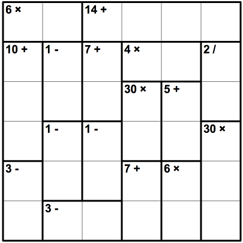

# Fast solver for KenKen (KenDoku) in RxJava
 
 There is another version that does not depend on RxJava under 
 
 https://github.com/2015xli/KenKen
 
 This version uses RxJava. To run it, please include RxJava package in the classpath.
 
 For SuDoKu solutions, input an integer that represents the matrix size, such as:
 ```java
 java -cp rxjava.jar:. kenkenrx.Kenkenrx 5
 ```
 It outputs all the SuDoKu solutions for 5x5 matrix.
 
 For KenKen solutions, provide a file that encodes a KenKen problem, such as:
 ```java
 java -cp rxjava.jar:. kenkenrx.Kenkenrx input/kenken.5
 ```
 It uses file ./input/kenken.5 as input and computes its solution.
 
The package includes a few example files for KenKen problems under ./input directory. 
Please just follow them to create your own KenKen problems. 
For example, for the following KenKen problem:



The input file input.6 has the following, which uses a _single_ character to represent one region, and uses operator + - * / to represent the computation. If it is a single cell region that has no computation, leave the operator blank. Multiplication operator can be either * or x .
```
K K B B B B  
a c l s s t
a c l $ # t
a d m $ # z
b d m v x z
b w w v x z

K 6 x
B 14 +
a 10 +
c 1 -
l 7 +
s 4 x
t 2 /
d 1 -
m 1 -
$ 30 x
# 5 +
b 3 -
w 3 -
v 7 +
x 6 x
z 30 x
```
